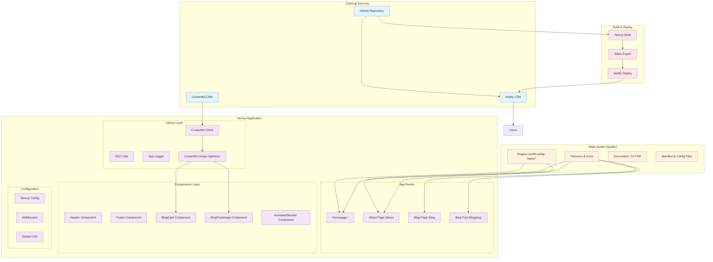
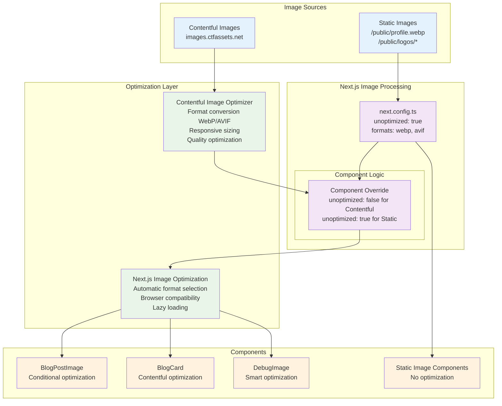
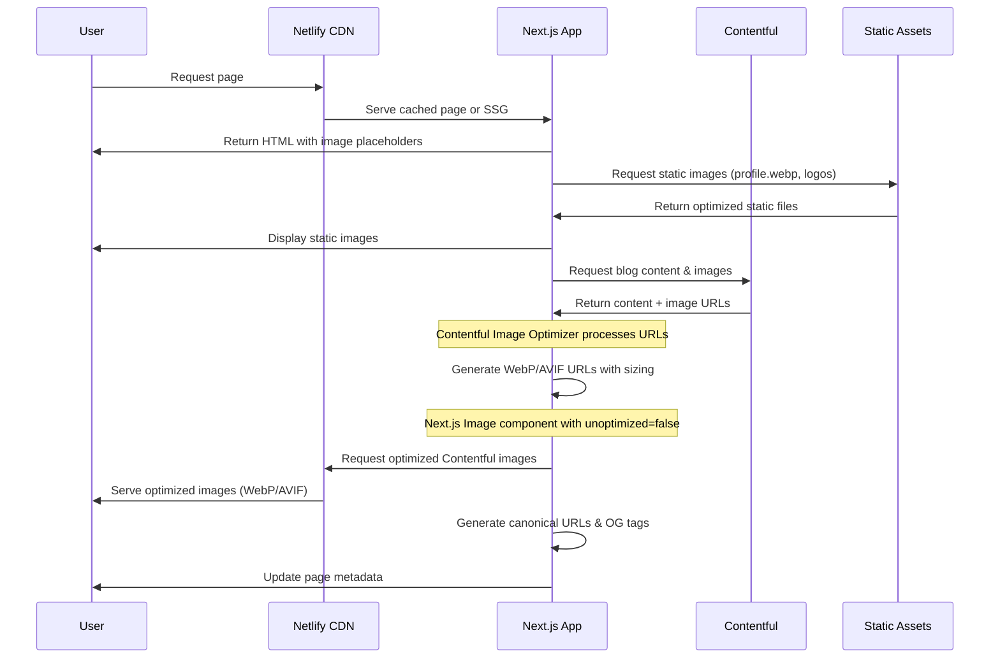
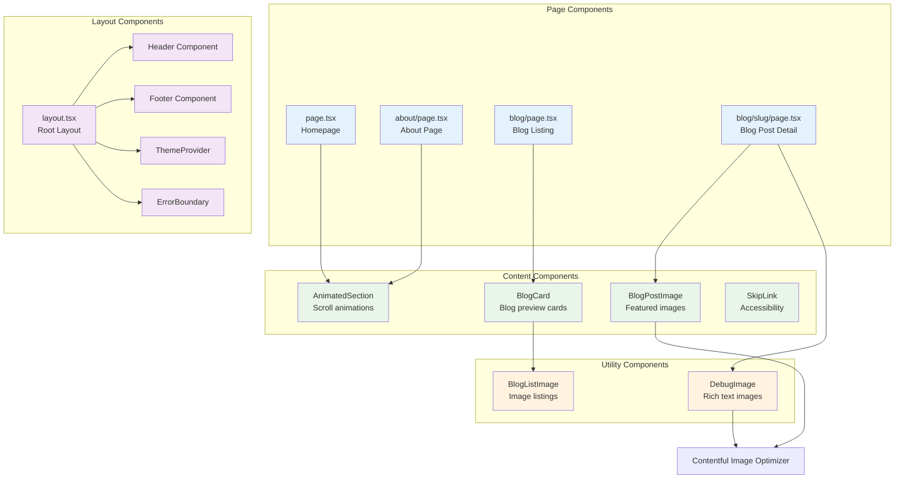
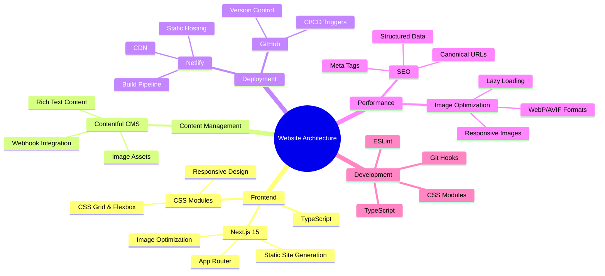

# System Architecture Diagram

## Overall System Architecture



## Image Optimization Architecture



## Data Flow Architecture



## Component Architecture



## Technology Stack



## File Structure Overview

```
mywebsite/
├── src/
│   ├── app/                    # App Router pages
│   │   ├── layout.tsx         # Root layout with SEO
│   │   ├── page.tsx           # Homepage with hero
│   │   ├── about/             # About page
│   │   └── blog/              # Blog pages (including slug)
│   ├── components/            # Reusable components
│   │   ├── BlogCard/          # Blog preview cards
│   │   ├── Header/            # Navigation
│   │   └── Footer/            # Site footer
│   ├── lib/                   # Utilities & services
│   │   ├── contentful.ts      # CMS integration
│   │   ├── seo.ts             # SEO utilities
│   │   ├── app-logger.ts      # Application logging
│   │   └── contentful-image-optimizer.ts
│   └── hooks/                 # Custom React hooks
├── public/                    # Static assets
│   ├── profile.webp           # Hero avatar
│   ├── logos/                 # Company logos
│   └── favicon.ico            # Site icons
├── docs/                      # Documentation
│   ├── guides/                # Implementation guides
│   └── fixes/                 # Fix documentation
└── next.config.ts             # Next.js configuration
```
