# System Architecture Diagram

## Overall System Architecture

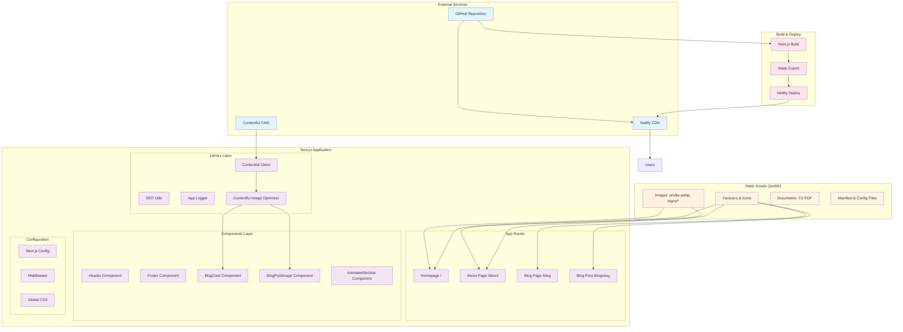

## Image Optimization Architecture

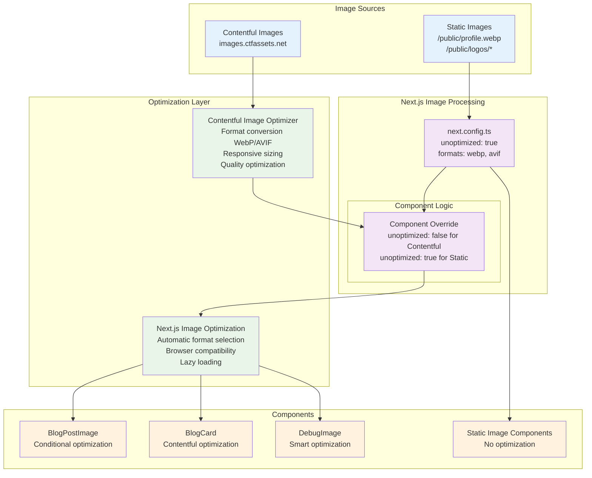

## Data Flow Architecture

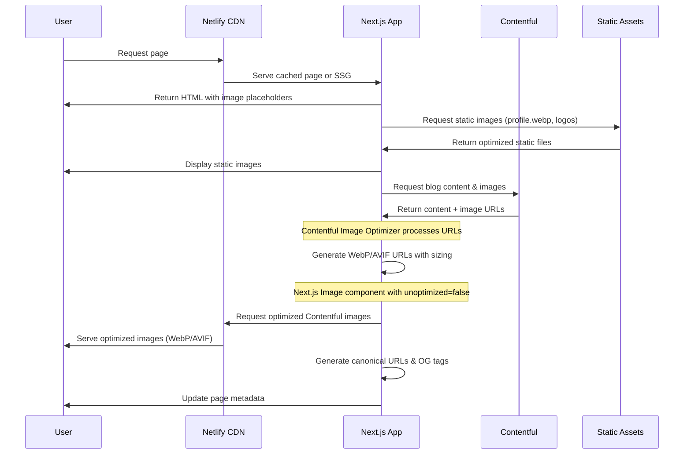

## Component Architecture

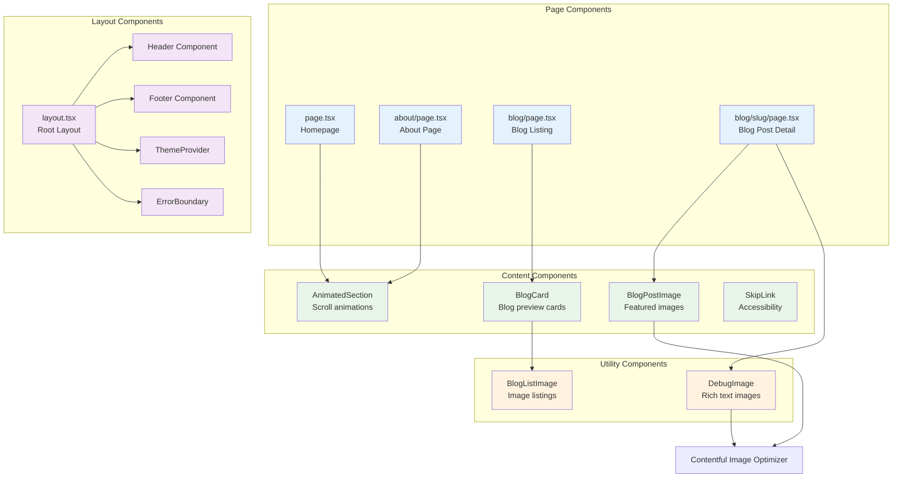

## Technology Stack

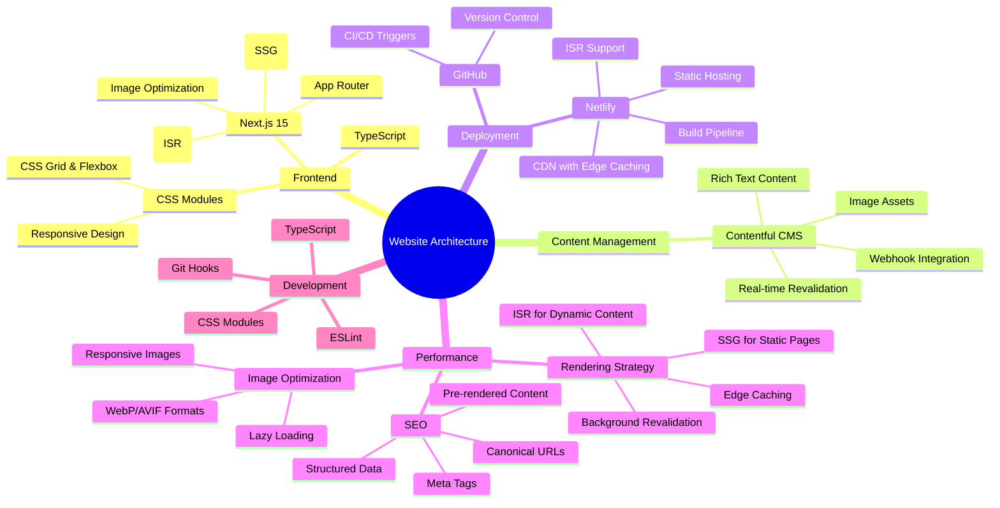

## File Structure Overview

```
mywebsite/
├── src/
│   ├── app/                    # App Router pages
│   │   ├── layout.tsx         # Root layout with SEO
│   │   ├── page.tsx           # Homepage with hero
│   │   ├── about/             # About page
│   │   └── blog/              # Blog pages (including slug)
│   ├── components/            # Reusable components
│   │   ├── BlogCard/          # Blog preview cards
│   │   ├── Header/            # Navigation
│   │   └── Footer/            # Site footer
│   ├── lib/                   # Utilities & services
│   │   ├── contentful.ts      # CMS integration
│   │   ├── seo.ts             # SEO utilities
│   │   ├── app-logger.ts      # Application logging
│   │   └── contentful-image-optimizer.ts
│   └── hooks/                 # Custom React hooks
├── public/                    # Static assets
│   ├── profile.webp           # Hero avatar
│   ├── logos/                 # Company logos
│   └── favicon.ico            # Site icons
├── docs/                      # Documentation
│   ├── guides/                # Implementation guides
│   └── fixes/                 # Fix documentation
└── next.config.ts             # Next.js configuration
```

## Rendering Strategy Architecture

### Next.js Rendering Methods Overview

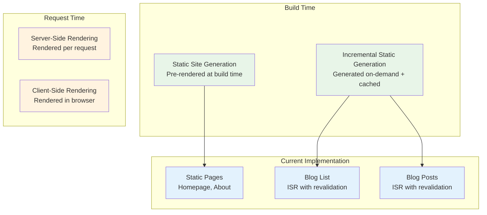

## ISR (Incremental Static Regeneration) Flow

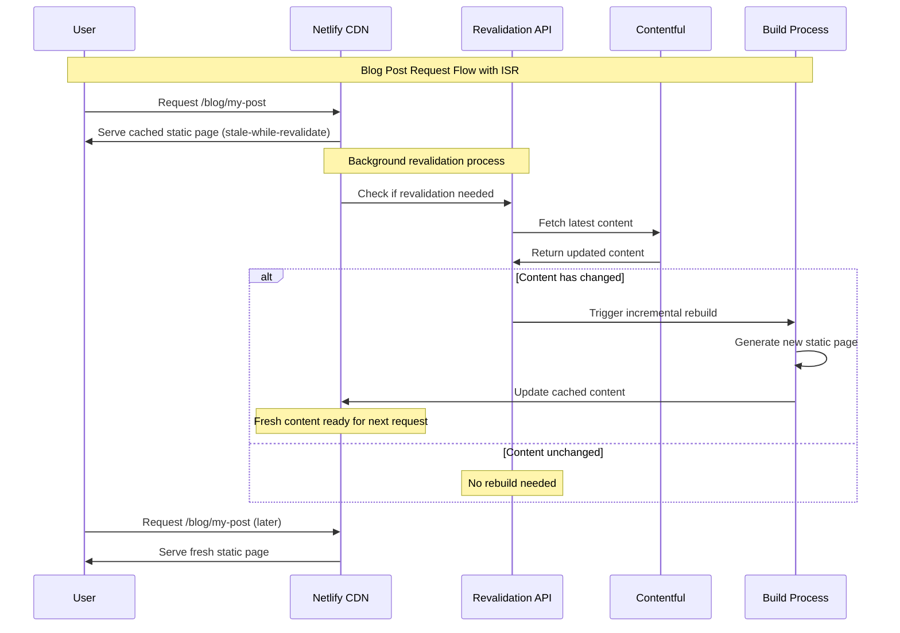

## Static Site Generation (SSG) Flow

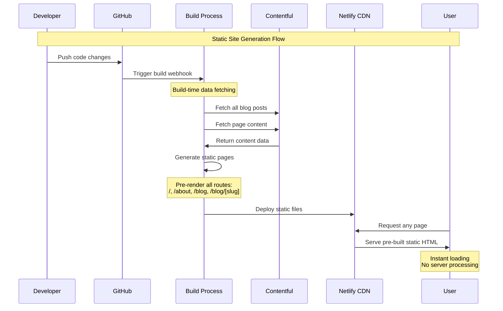

## Current Page Rendering Strategy

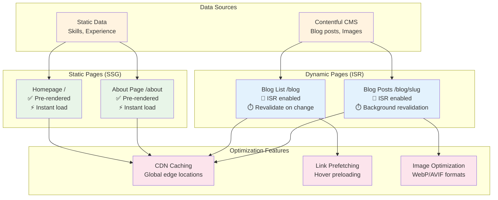

## Revalidation Strategy

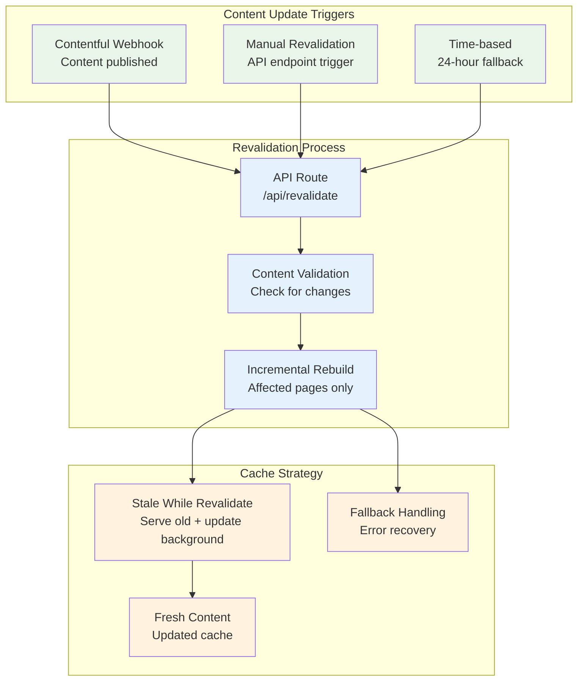

## Performance Benefits by Rendering Method

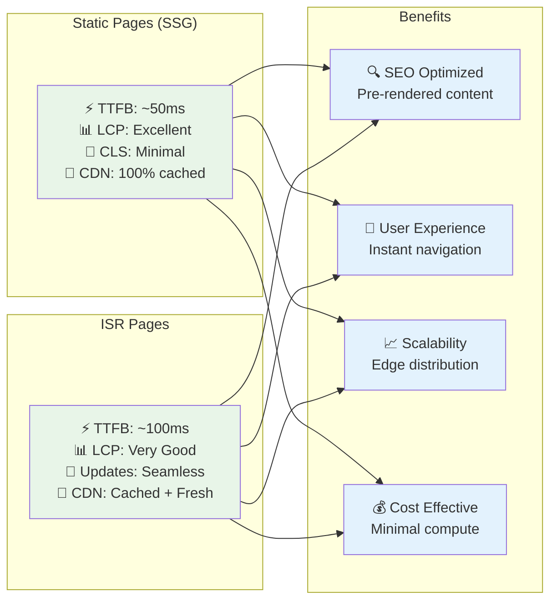

## Implementation Details

### ISR Configuration

Your website uses the following ISR configuration:

**Blog Post Pages (`/blog/[slug]/page.tsx`)**:

```typescript
export async function generateStaticParams() {
  // Pre-generate paths for all published blog posts at build time
  const posts = await getBlogPosts()
  return posts.map((post) => ({ slug: post.fields.slug }))
}

// ISR configuration
export const revalidate = 86400 // Revalidate every 24 hours
export const dynamic = 'force-static' // Force static generation
```

**Blog List Page (`/blog/page.tsx`)**:

```typescript
// ISR with on-demand revalidation
export const revalidate = 86400 // 24 hours fallback
```

**Revalidation API (`/api/revalidate/route.ts`)**:

```typescript
export async function POST(request: Request) {
  const { path } = await request.json()

  try {
    await revalidatePath(path)
    return NextResponse.json({ revalidated: true })
  } catch (err) {
    return NextResponse.json({ error: 'Error revalidating' }, { status: 500 })
  }
}
```

### Contentful Webhook Integration

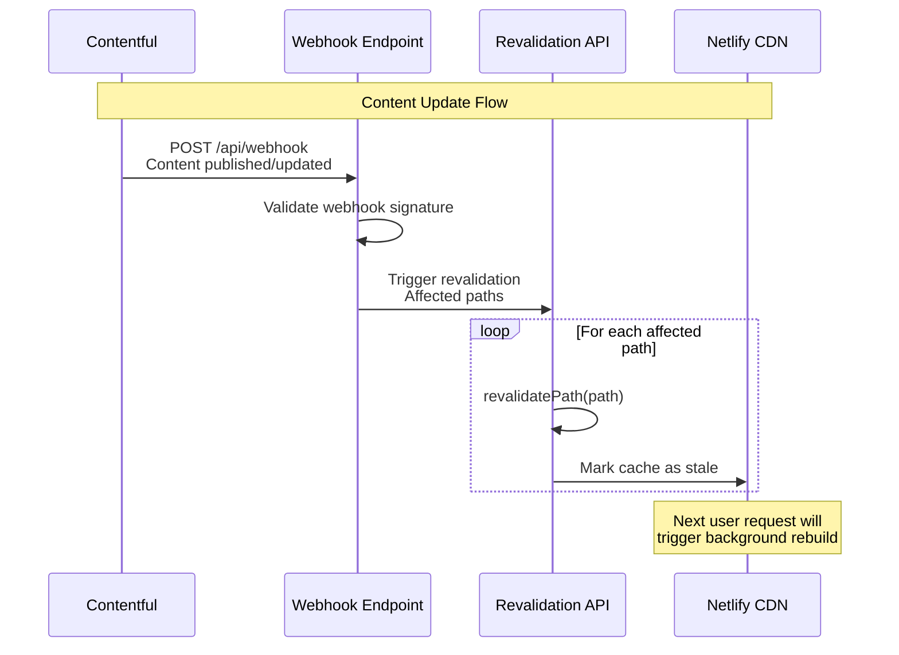

### Cache Strategy Implementation

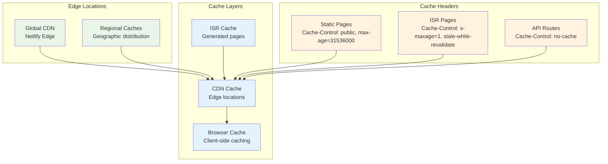

## Architecture Summary

### Rendering Strategy Overview

| Page Type                     | Rendering Method | Revalidation    | Use Case                            |
| ----------------------------- | ---------------- | --------------- | ----------------------------------- |
| **Homepage (/)**              | SSG              | Build time only | Static content, maximum performance |
| **About (/about)**            | SSG              | Build time only | Static content, skills, experience  |
| **Blog List (/blog)**         | ISR              | 24h + webhook   | Dynamic list, frequent updates      |
| **Blog Posts (/blog/[slug])** | ISR              | 1h + webhook    | Dynamic content, SEO optimized      |

### Performance Characteristics

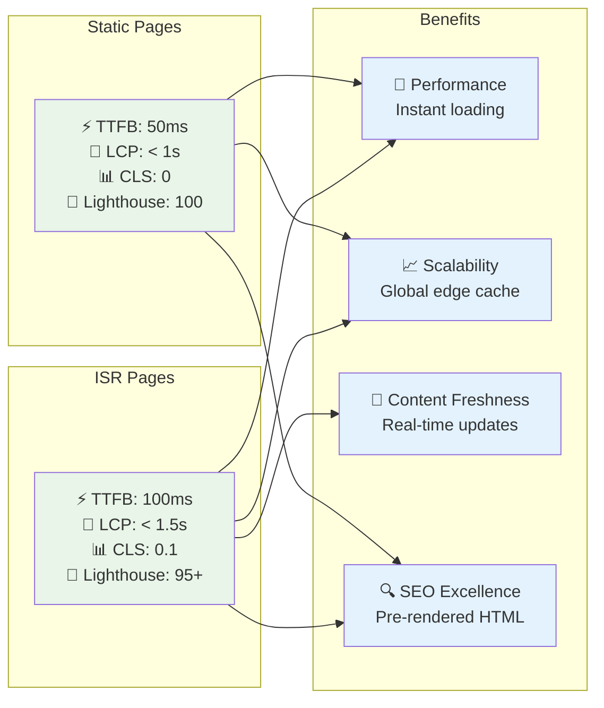

### Content Update Flow

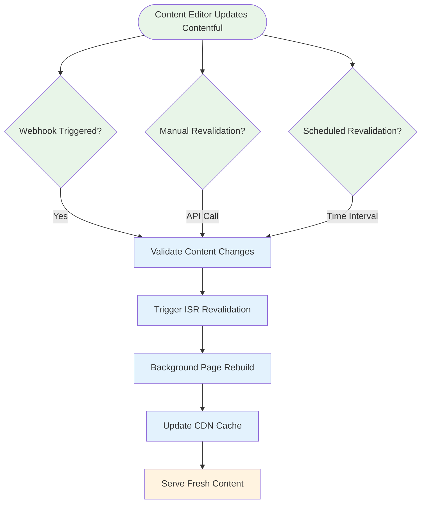

### Deployment Architecture

The website employs a **hybrid static + ISR architecture** that provides:

1. **Build-time optimization** for static content (homepage, about)
2. **Runtime flexibility** for dynamic content (blog posts)
3. **Edge distribution** via Netlify CDN
4. **Real-time content updates** through Contentful webhooks
5. **Graceful degradation** with fallback revalidation intervals

This architecture ensures optimal performance while maintaining content freshness and editorial flexibility.
